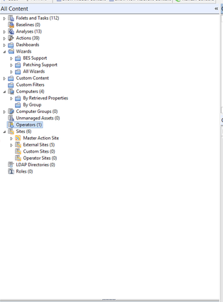
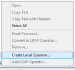
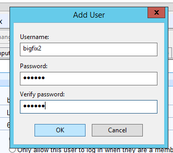
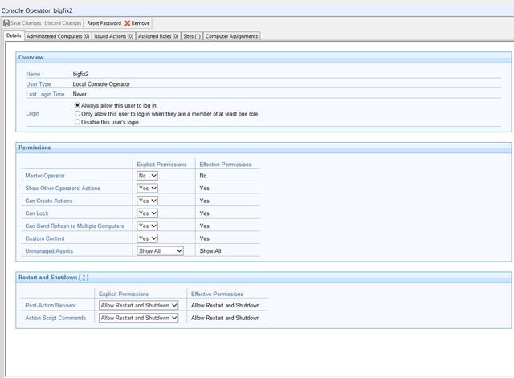

Equivalent Action in Console
===

Open the operators tab.

Right-click the field containing existing operators.

Select "Create local operator".

Add username and password.

Select the permissions, explained below.

Explanation of [operator.xml](operator.xml)
===
All of these tags go under the "Operator" tag in the [operator.xml](operator.xml) file provided, in the order displayed here. Some tags were not included in operator.xml, but can be written in. Alternatively, run the following curl command:

    curl -X GET --user username:password https://server:port/api/operators

and fill in the XML file returned with the data of the operator you wish to create. If multiple operators are returned, remove all operator tags but one. You will have to add the "Password" tag immediately below the "Name" tag.

* Name - (Permissible Values: any string) Name of the operator
* Password - (Permissible Values: any string) Operator password
* MasterOperator - (Optional, defaults to false) (Permissible Values: true, false) Is the operator created a master operator? Note: If MasterOperator is set to true, the remaining tags are unneccessary to include in the xml file and will be set to their default values. Any attempt to change any of the remaining tags to non-default values will be overriden back to their default values.
* CustomContent - (Optional, defaults to true) (Permissible Values: true, false) Can this operator create custom content?
* ShowOtherActions - (Optional, defaults to true) (Permissible Values: true, false) Can this operator see actions submitted by other operators?
* CanCreateActions - (Optional, defaults to true) (Permissible Values: true, false) Can this operator create actions?
* PostActionBehaviorPrivelege - (Optional, defaults to AllowRestartAndShutdown) (Permissible Values: AllowRestartAndShutdown, AllowRestartOnly, None) What can this operator force a computer to do after an action?
* ActionScriptCommandsPrivelege - (Optional, defaults to AllowRestartAndShutdown) (Permissible Values: AllowRestartAndShutdown, AllowRestartOnly, None) What can this operator force a computer to do at any time?
* CanLock - (Optional, defaults to true) (Permissible Values: true, false) Can the operator lock targets (prevent other operators from running activities on these targets)?
* CanSendMultipleRefresh - (Optional, defaults to true) (Permissible Values: true, false) Can this operator run a refresh on more than one target?
* LoginPermission - (Optional, defaults to Unrestricted) (Permissible Values: Unrestricted, RoleRestricted, Disabled) When can this operator log in?
  * Unrestricted: always
  * RoleRestricted: only when they are a member of at least one role
  * Disabled: never
* UnmanagedAssetPrivelege - (Optional, defaults to ShowAll) (Permissible Values: ShowAll, ScanPoint, ShowNone) Specifies if the operator can manage assets on which no IBM Endpoint Manager component is installed

Usage
===
This command will POST the file [operator.xml](operator.xml) to the server to create a
non-master-operator `eddard` with password `winterfell`:

    curl -X POST --data-binary @operator.xml --user username:password https://server:port/api/operators

See [cURL overview](../../README.md#cURL) for more information on using [cURL](http://curl.haxx.se/).
